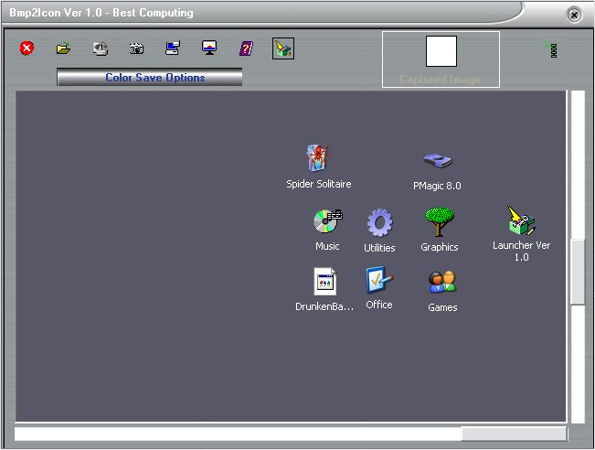



## Bmp2Icon\.zip

### Description

Grab a 32 x 32 sized 'Icon'from a picture source.

Screen capture,client capture.Save as a TRUE icon,NOT BMP based.
 
### More Info
 
No special requirements,but knowledge of API's would be good.

How to load a Visual Basic Project VB6.When compiled into an 'exe' it will be XP orientated and as such should only be run in an XP environment.It MAY work on other Windows platforms,but no guarantees.

As above 'purpose'

Icons can be saved as : Mono,4Bit,8Bit or 24Bit.

Some color saves are only as good as the original source picture,so experiment with the 'save as'options

             |
---                |---
**Submitted On**   |2003-11-21 10:19:02
**By**             |[Best Computing](https://github.com/Planet-Source-Code/PSCIndex/blob/master/ByAuthor/best-computing.md)
**Level**          |Advanced
**User Rating**    |4.4 (35 globes from 8 users)
**Compatibility**  |VB 6\.0
**Category**       |[Graphics](https://github.com/Planet-Source-Code/PSCIndex/blob/master/ByCategory/graphics__1-46.md)
**World**          |[Visual Basic](https://github.com/Planet-Source-Code/PSCIndex/blob/master/ByWorld/visual-basic.md)
**Archive File**   |[Bmp2Icon\_z16745111212003\.zip](https://github.com/Planet-Source-Code/best-computing-bmp2icon-zip__1-50031/archive/master.zip)

### API Declarations

A lot

